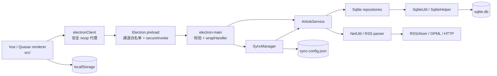

# 当前架构

> 这是当前实现的结构描述，不是目标架构设计。所有节点均由当前入口、导入和调用关系验证。

## 进程边界

### 渲染进程

`src/` 是 Quasar 的 UI 程序：`App.vue` 注册主题和全局快捷键，路由使用 hash mode（`src/router/index.ts:19-54`、`quasar.config.js:48-67`），`AppLayout` 提供 Header、Drawer 和页面容器。状态主要位于 Pinia store，数据访问必须经过 `src/services/electronClient.ts`。

非 Electron 环境下 `electronClient` 不抛出，而返回默认空集合、零统计、失败的 legacy `ApiResponse` 或 no-op（`electronClient.ts:23-108`）。这是浏览器预览可运行、但不能实际读本地数据库的原因。

### Preload

`src-electron/electron-preload.ts` 是唯一 renderer-main 桥：

- `ALLOWED_CHANNELS` 允许 37 个显式 channel；
- `secureInvoke()` 拒绝未知 channel；
- 主进程统一 envelope `{data}` / `{error}` 被解封装；
- legacy `ApiResponse<T>` 会保留，不会二次解封装；
- `contextBridge.exposeInMainWorld('electronAPI', electronAPI)` 暴露由 `ElectronContract` 定义的接口。

### 主进程

`src-electron/electron-main.ts` 是 bootstrap 和 presentation adapter：它设置全局异常提示、创建受 sandbox/context isolation 保护的窗口、CSP、外链拦截及全部 IPC handler。各 handler 先在这里做长度、ID、文件夹名与 HTTP(S) URL 校验，然后调用 `ArticleService` 或 `SyncManager`。

主进程实际以“新 API + 兼容 API”共存：

| API 组 | 代表 channel | 返回形状 |
| --- | --- | --- |
| legacy RSS/Folder | `rss:addRssSubscription`、`rss:getRssInfoListFromDb`、`rss:queryPostContentByGuid`、`addFolder` | `ApiResponse<T>` |
| 新 Article/Feed/Folder | `article:getArticles`、`feed:addFeed`、`folder:renameFolder` | 直接领域数据 |
| 收藏兼容 | `article:toggleFavorite` 与 `article:addFavoritePost/removeFavoritePost` | boolean/void；旧入口转换为 idempotent set |
| 同步 | `sync:*` | 配置、状态、进度和统计对象 |

## 应用与数据访问结构

`DIContainer` 在第一次 `getArticleService()` 时创建三个 SQLite repository 与一个 `ArticleService` 单例（`src-electron/infrastructure/di/Container.ts:16-95`）。Repository interface 位于 `domain/repositories/Interfaces.ts`，实现位于 `infrastructure/persistence/ArticleRepositoryImpl.ts`。

当前分层并非严格单向：`ArticleService` 直接使用 `NetUtil`、`RssParserAdapter` 和 `buildAvatarUrl`（`ArticleService.ts:18-20`）；repository interface 的 `syncArticles` 参数类型又从 persistence 导入（`Interfaces.ts:23-24`）。这是“局部 ports-and-adapters”，不是完全隔离的 Clean Architecture。

## 数据模型与保存方式

`src/common/models.ts` 是 Article、FeedSource、Folder、新旧 RSS DTO 的公共类型源。SQLite schema 只有：

- `_meta`：schema 版本；
- `folder_info`：唯一的 `name`、可空 `parent_id`；
- `rss_info`：唯一 `rss_id`，外键指向 folder；
- `post_info`：全局唯一 `guid`，外键指向 rss，`read`/`favorite` 是整数标志；
- `post_info_fts`：FTS5 虚表及 insert/delete/update trigger。

实现位置：`SqliteHelper.createTables/createFtsTable()`（`src-electron/infrastructure/persistence/SqliteHelper.ts:204-338`）。`post_info.content` 由 `SqliteUtil.insertPostInfo()` Base64 化写入（`sqlite.ts:155-198`）。

## 异步与并发模型

- 主进程启动：数据库初始化与窗口创建并行，最终 await `dbReadyPromise`。见 `electron-main.ts:402-418,1102-1105`。
- 全量同步：一次最多 5 个 feed 并发，批次之间等待 `Promise.allSettled`。见 `SyncManager.syncAll()`。
- 数据库操作：所有 `run/get/all` 进入 `OperationQueue`，再获得读写锁。见 `SqliteHelper.ts:68-120,340-398`。
- 自动同步：设置保存到 `{userData}/sync-config.json`；定时器仅在 enabled 时生效。见 `SyncManager.ts:78-118,270-307`。
- UI 进度：`syncProgressStore`/`useSync` 使用 500ms 轮询 `sync:getProgress`，不是事件推送。见 `src/stores/syncProgressStore.ts`、`src/composables/useSync.ts`。

## 安全边界与副作用

- renderer 无 Node 集成，preload 有 channel whitelist；主进程不把 stack trace 传回 renderer。
- 文章正文以 DOMPurify 白名单消毒；外部窗口导航和 `window.open` 交给系统浏览器。
- URL 接口只接受 `http:`/`https:`；单篇内容最大 10MB，列表分页上限 500，搜索返回上限 200。见 `electron-main.ts:71-228`。
- OS/文件副作用：SQLite、同步配置、OPML 文件选择与读取、桌面通知、外部浏览器、窗口最小化/关闭。
