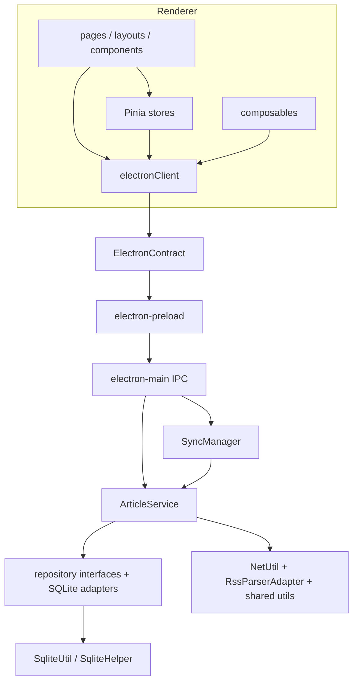

# 当前依赖关系

> 静态 import 图扫描覆盖 `src/`、`src-electron/`、`src-ssr/` 的 `.ts/.vue/.js`（排除声明文件），按相对路径和 Quasar alias 解析。结果：**0 个文件级强连通分量**，即未发现静态循环依赖。

## 高扇入模块

| 模块 | 静态直接导入者 | 作用 |
| --- | ---: | --- |
| `src/common/models.ts` | 27 | 新旧 DTO、Article/Feed/Folder 的公共类型源。 |
| `src/services/electronClient.ts` | 23 | renderer 到 preload 的唯一常规访问点。 |
| `src/stores/rssInfoStore.ts` | 14 | 订阅树、legacy 管理操作和统计中心。 |
| `src/common/ErrorMsg.ts` | 12 | legacy `ApiResponse`、错误处理及 unwrap 工具。 |
| `src/stores/systemDialogStore.ts` | 10 | 多个新增/编辑/移动 dialog 的共享开关与 payload。 |
| `src/stores/themeStore.ts` | 5 | 全局主题状态与 DOM/localStorage 副作用。 |

这些模块的 API 或类型变动会横向影响多处 UI；应被视为兼容面。

## 高扇出模块

| 模块 | 直接依赖数 | 说明 |
| --- | ---: | --- |
| `src/layouts/AppHeader.vue` | 9 | 路由、IPC、注入、订阅状态与多个 dialog。 |
| `src/pages/Content.vue` | 8 | IPC、消毒、收藏、阅读状态/体验、路由和 Quasar。 |
| `src/pages/HomePage.vue` | 7 | RSS、主题、同步进度、dialog、IPC、路由。 |
| `src/layouts/AppDrawer.vue` | 6 | 订阅树注入、搜索、路由和编辑文件夹。 |
| `src/layouts/AppLayout.vue` | 6 | layout、主题、RSS 初始化和启动同步。 |
| `src-electron/electron-main.ts` | 6 | Electron、文件、HTTP、持久化、DI、同步、OPML。 |

## 层间关系

### 确认的反向或跨层依赖

1. `ArticleService`（application）直接导入 `infrastructure/network/NetUtil`、`infrastructure/parsing/RssParserAdapter`、`shared/utils`。见 `src-electron/application/services/ArticleService.ts:18-20`。
2. `ArticleRepository`（domain port）在 `syncArticles` 中使用 `../../infrastructure/persistence/common` 的 `PostInfoItem`。见 `src-electron/domain/repositories/Interfaces.ts:23-24`。
3. 多个 UI 组件不经过 store，直接调用 `electronClient`，例如 `PostListItem.vue`、`Content.vue`、`RssItemContextMenu.vue`、`FolderContextMenu.vue`、`SettingPage.vue`。这使“页面/组件 → IPC”成为实际允许的跨层调用。
4. `src/common/util.ts` 导入 router 绑定，并在 router 不可用时写 `location.hash`；路由桥通过 `window.__APP_ROUTER__` 作为回退。见 `src/common/util.ts:1-55`、`src/boot/router-bridge.ts`。

## 双轨 API 与状态依赖

| 领域 | 当前主用路径 | 并存/未接入路径 | 影响 |
| --- | --- | --- | --- |
| 订阅/文件夹 | `rssInfoStore` + legacy RSS IPC | `feedStore`、`folderStore`、`useSubscription` + v2 API | 新功能若选错路径，会形成互不刷新的状态。 |
| 文章 | 页面直接 legacy list/content IPC | `articleStore`、`useArticle` + v2 article API 无产品调用者 | Article DTO 映射和错误处理存在两套实现。 |
| 收藏 | `favoriteStore` + legacy favorite IPC，正文用 `toggleFavorite` | `useFavorite` | 同一 `favorite` 标志但刷新策略不同。 |
| 搜索 | `searchStore`（Drawer/搜索组件） | `useSearch` | 都写相同 localStorage 概念但维护各自 ref。 |
| 同步进度 | `syncProgressStore`（首页） | `useSync` | 两个独立轮询器。 |
| 主题 | `themeStore`（实际 UI） | `useTheme` | 两者都读写 `themeMode` 与 DOM class。 |

## 外部包与实际使用

| 包 | 实际调用位置 | 备注 |
| --- | --- | --- |
| Electron | main/preload/network/sync | 窗口、IPC、`net`、Notification、shell。 |
| Quasar / Vue / Pinia / Vue Router | `src/` | UI、路由、状态。 |
| sqlite3 + appdata-path | `SqliteHelper.ts` | 本机 SQLite 文件。 |
| rss-parser | `RssParserAdapter.ts` | URL 或 XML 字符串解析。 |
| opml-to-json | `OpmlParserAdapter.ts` | OPML 导入。 |
| axios | `NetUtil.ts` 与 `boot/axios.ts` | 网络回退；boot 的示例 API 未被业务消费。 |
| DOMPurify | `src/utils/sanitize.ts` | RSS HTML 消毒。 |
| uuid | `src-electron/shared/utils.ts` | `getRssId()`，当前 `ArticleService.addFeed` 未使用它。 |
| moment、@vueuse/core、fast-xml-parser | 无源码 import | 声明但未见当前业务调用。 |

## 循环依赖结论与限制

静态图没有循环，不等于没有运行时循环：进程级单例（`SyncManager`、`SqliteHelper`、`SqliteUtil`、`CacheManager`、DI container）、全局 DOM listener 和 `window.__APP_ROUTER__` 都是共享运行时状态；它们不会显示为 import SCC，却会增加初始化顺序与测试隔离风险。
