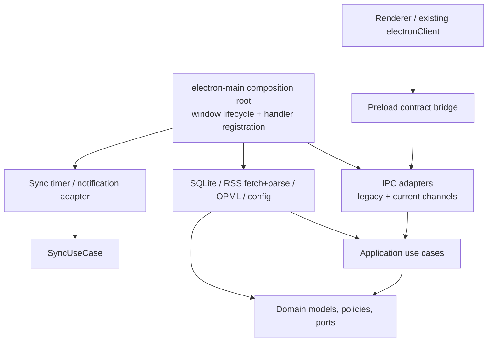

# 目标架构

> 范围：本文定义 Electron **主进程**的目标架构和迁移方向。渲染端页面、组件和
> Pinia Store 在本轮保持现有 IPC 消费者角色，不以目录重排或 Store 合并作为前置工作。
> 依据：[代码库研究](../codebase-research.md)、[当前架构](current-architecture.md)、
> [当前依赖](current-dependencies.md)、[业务能力](business-capabilities.md) 和
> [重构宪章](../../.specify/memory/constitution.md)。

## 目标与非目标

目标是把当前集中在 `electron-main.ts`、`ArticleService`、`SqliteUtil` 和
`SqliteHelper` 中的职责分开，同时保持 renderer 已观察到的 IPC 行为、SQLite 数据和
同步语义不变。目标架构是一个进程内的模块化单体，不是新的服务端。

本文不要求：替换 SQLite、引入 ORM、消息总线、CQRS、远程服务、第三方 DI 框架，或
重写渲染端。目录迁移只有在形成真实隔离边界或纠正依赖方向时才有价值。

## 稳定业务能力边界

以下边界从当前可达 UI、IPC 与服务调用链归纳；它们是迁移和规格的最小单位，而不是
页面或数据库表的别名。

| 能力 | 负责的业务结果 | 不负责的事项 |
| --- | --- | --- |
| 订阅目录 | 创建、查询、移除订阅；维护订阅与文件夹的归属 | RSS 网络获取、文章同步、renderer 列表状态 |
| 文件夹管理 | 创建、查询、重命名、删除扁平文件夹 | 嵌套文件夹产品能力、订阅编辑策略 |
| 文章库 | 保存和查询文章；已读、收藏、统计、搜索 | 渲染 HTML、滚动进度、网络抓取 |
| Feed 同步 | 获取和解析一个 feed，并把新增文章交给文章库 | 定时调度、桌面通知、UI 进度轮询 |
| 同步调度 | 全量同步、并发限制、进度、配置、通知 | 单个 feed 的业务保存规则 |
| OPML 导入 | 读取 OPML 并编排文件夹/订阅创建 | OPML 导出或任意层级嵌套支持（除非独立规格批准） |
| 桌面与 IPC | 验证输入、映射 IPC 契约、窗口/外链/文件对话框 | 订阅、文章或同步的业务规则 |

阅读偏好、正文消毒、阅读进度和页面导航继续是 renderer 侧能力；它们通过既有 IPC
取得主进程数据，但不进入主进程领域模型。

## 分层与依赖方向



依赖只允许朝内：接口适配层依赖应用层；应用层依赖领域模型和领域端口；基础设施实现
领域端口，并可被组合根装配。基础设施不得被领域层或应用层直接导入。组合根是例外：
它只负责创建实现、连接适配器和管理 Electron 生命周期，不能承载业务分支。

### 领域层

领域层提供进程内、与 Electron/SQLite 无关的模型、规则和端口。它拥有 Feed、Folder、
Article、同步结果和分页/查询值对象，以及以下窄端口的定义：

- `FeedRepository`、`FolderRepository`、`ArticleRepository`
- `FeedDocumentFetcher`、`FeedDocumentParser`
- `OpmlDocumentReader`
- `SyncConfigurationStore`
- `DesktopNotifier`

领域层不导入 Electron、`sqlite3`、`rss-parser`、`opml-to-json`、文件系统或 renderer DTO。
它也不持有单例、定时器、窗口或 IPC envelope。

### 应用层

应用层按能力暴露用例并编排事务、端口和领域规则。它是唯一能跨多个领域端口完成一个
业务结果的层。建议的公开用例接口如下；具体类型在迁移时以当前行为为准。

```ts
interface SubscriptionCommands {
  add(input: AddSubscription): Promise<void>
  remove(feedId: FeedId): Promise<void>
}

interface SubscriptionQueries {
  list(folderName?: string): Promise<FeedSummary[]>
}

interface FolderCommands {
  add(name: string): Promise<void>
  rename(oldName: string, newName: string): Promise<void>
  remove(name: string): Promise<void>
}

interface ArticleQueries {
  list(query: ArticleQuery, page: Page): Promise<ArticlePage>
  get(id: ArticleId): Promise<ArticleDetail | null>
  search(query: SearchQuery): Promise<ArticleSummary[]>
  statistics(): Promise<ArticleStatistics>
}

interface ReadingCommands {
  setRead(id: ArticleId, read: boolean): Promise<boolean>
  markAllRead(scope?: ReadScope): Promise<void>
}

interface FavoriteCommands {
  setFavorite(id: ArticleId, favorite: boolean): Promise<boolean>
  clearAll(): Promise<void>
}

interface FeedSynchronization {
  syncOne(feedId: FeedId): Promise<SyncOneResult>
  syncAll(options?: SyncOptions): Promise<SyncSummary>
}

interface OpmlImport {
  import(document: string): Promise<OpmlImportResult>
}
```

`FeedSynchronization.syncOne` 负责“获取 → 解析 → 转换 → 新文章写入 → 更新 feed 时间”；
`syncAll` 负责枚举、并发限制和汇总。计时器、文件配置和 Notification 留在同步调度适配
层。这样同步规则可在不启动 Electron 窗口的测试中验证。

### 基础设施层

基础设施层包含端口实现：SQLite repository、SQLite schema/migration/队列、RSS 网络和
解析器、OPML 解析器、同步配置文件、Electron Notification 和文件对话框。当前
`SqliteHelper` 的连接/队列/迁移职责可暂时保留；`SqliteUtil` 的 legacy DTO 映射必须在
迁移后逐步收口到 IPC adapter 或 SQLite adapter，不再成为应用层公共依赖。

### 接口适配层

IPC adapter 把 `wrapHandler`、参数校验、legacy `ApiResponse<T>`、当前直接返回值和
renderer DTO 映射限制在边界。legacy 和 current IPC 可以同时调用同一个应用用例。
Preload 继续是唯一 renderer bridge；`electronClient` 和其 noop 行为是既有兼容面，在
所有 renderer 调用方迁移前不得改变。

## 组合根与公开兼容面

目标中的 `electron-main.ts` 只保留以下公开职责：创建窗口、CSP/导航策略、进程错误处理、
初始化基础设施、构造应用用例、注册 IPC adapter、启动/停止同步调度器。它不直接查询
SQLite，不解析 RSS，不决定文章保存规则，也不进行 legacy DTO 的业务组装。

稳定的对外兼容面是：preload 白名单中的 IPC channel 名称、参数验证结果、legacy
`ApiResponse` envelope、当前 renderer 所消费的文章/订阅字段，以及 SQLite 中已存在的
数据和迁移。内部用例接口不是 renderer 契约；它们可以在有适配器和测试时演进。

## 共享代码策略

| 类别 | 处理 | 原因 |
| --- | --- | --- |
| `src/common/models.ts` 与 IPC contract | 保留为进程边界 DTO；逐步拆出仅主进程领域类型 | renderer 与 preload 需要稳定形状，领域模型不应反向服从 legacy DTO |
| `ErrorMsg` 与 envelope 工具 | 保留在 IPC 兼容适配层 | legacy 响应是外部契约，不应渗透到用例 |
| 纯字符串、ID、日期转换 | 保留/抽为无框架纯函数 | 可被多个 adapter 使用，且不引入依赖方向问题 |
| `SqliteHelper` 连接、队列、schema migration | 暂时保留在 SQLite adapter 内 | 数据兼容性和并发行为高风险，先隔离再替换 |
| `SqliteUtil` legacy 业务 API | 拆分或封装，不再给应用层新增调用 | 它混合存储、编码、legacy DTO 与业务流程 |
| `ArticleService` | 按上述用例接口拆分或作为过渡 facade | 现有职责跨订阅、文章、同步和基础设施 |
| renderer Store/composable | 本轮保留，不迁入主进程核心 | 当前目标只隔离主进程，避免扩大规格 |

## 验收条件

目标架构的每个迁移增量都必须保持 `npm run build`、活动 Vitest 测试和 `npm run dev:electron`
启动路径可用。它还必须明确：保留的 IPC/数据行为、切换/兼容机制、回滚步骤、受影响的
高风险行为测试，以及没有新增的反向依赖。详见
[依赖规则](dependency-rules.md)、[模块边界](module-boundaries.md) 和
[重构路线图](../refactoring-roadmap.md)。
